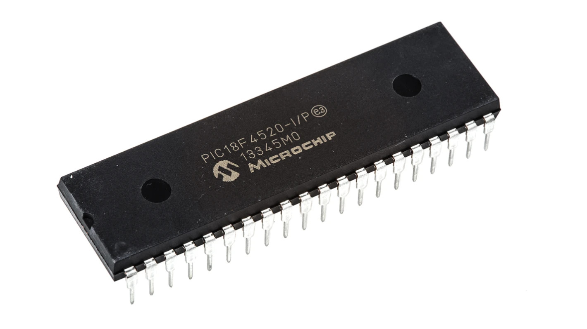
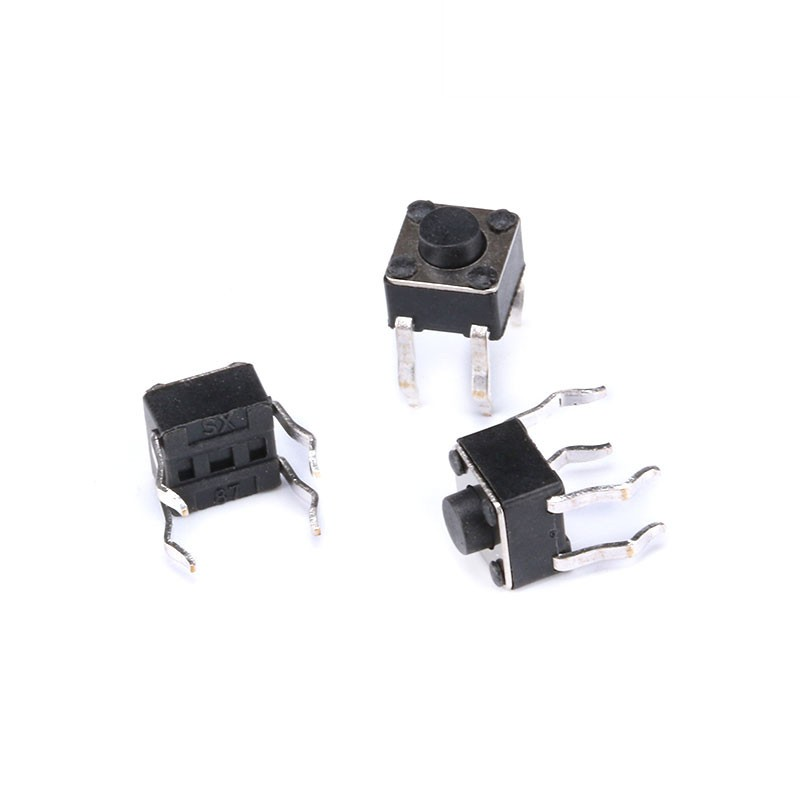
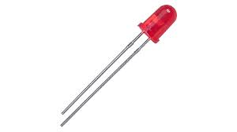
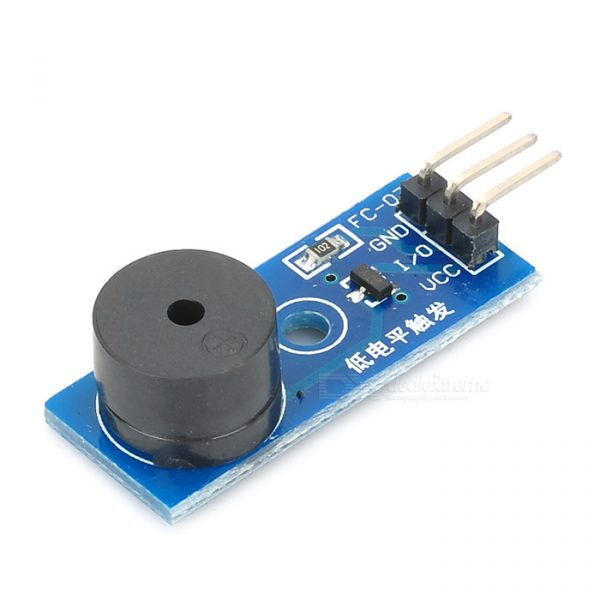

# RFID-Electronic-Lock

## Introduction

一個使用 **RDM6300** 的電子鎖系統  
目前為止，此系統有三個狀態，分別如下：
1. ``註冊``狀態
2. ``註銷``狀態
3. ``檢查``狀態

狀態之間，使用**可變電阻**和**按鈕**進行轉換。  
例如：使用**按鈕**在 ``註冊`` 跟 ``註銷`` 模式切換、使用**可變電阻**在 ``註冊`` 跟 ``檢查`` 模式切換。

使用 **LED** 燈泡表示目前狀態。

可以將 **RFID** 感應卡靠近 **RDM6300**，**RDM6300** 會讀取卡片內容進行判斷，並將執行結果透過 **TTL** 線，顯示於電腦上。基於不同的狀態，會有不同的結果，以下為各個狀態的簡單介紹：

#### 註冊狀態
此狀態的燈泡呈現如下：  
  |                                   LED1                                    |                                   LED2                                    |
  |---------------------------------------------------------------------------|---------------------------------------------------------------------------|
  |  |  |
 
執行結果有數種可能：
* 成功註冊：正確操作
* ID 卡號已註冊：錯誤操作
* ID 資料庫已滿：錯誤操作
* ID 讀取不正確：錯誤操作

#### 註銷狀態
此狀態的燈泡呈現如下：  
  |                                   LED1                                    |                                    LED2                                    |
  |---------------------------------------------------------------------------|----------------------------------------------------------------------------|
  |  |  |

執行結果有數種可能：
* 成功註銷：正確操作
* 未找到 ID 卡號：錯誤操作
* ID 資料庫為空：錯誤操作
* ID 讀取不正確：錯誤操作

#### 檢查狀態
此狀態的燈泡呈現如下：  
  |                                    LED1                                    |                                    LED2                                   |
  |----------------------------------------------------------------------------|---------------------------------------------------------------------------|
  |  |  |

執行結果有數種可能：
* 檢查成功：正確操作
* 未找到 ID 卡號：錯誤操作
* ID 讀取不正確：錯誤操作

蜂鳴器會在 **正確操作** 和 **錯誤操作** 時，發出不同的聲響，以提醒使用者操作是否錯誤。

## Demo
  

## Components

  
PIC18F4520

  
  

  
RDM6300

  
  
  

  |   RDM6300 Pin   |      Coil      |     PIC18F4520     |
  |-----------------|----------------|--------------------|
  | `ANT1`          |  `Black Line`  |         X          |
  | `ANT2`          |   `Red Line`   |         X          |
  | `Vcc (down)`    |       X        |       `Vdd`        |
  | `GND (down)`    |       X        |       `Vss`        |
  | `TX`            |       X        |      `RC7/RX`      |

  
Button

  

  |      Button      |                                                                          PIC18F4520                                                                          |
  |------------------|--------------------------------------------------------------------------------------------------------------------------------------------------------------|
  |   ``One side``   | ``RB0/INT0`` → ``Resistor`` → ``Vdd`` &nbsp;&nbsp;&nbsp;&nbsp;&nbsp;&nbsp;&nbsp;&nbsp;&nbsp;&nbsp;&nbsp;&nbsp;&nbsp;&nbsp;&nbsp;&nbsp;&nbsp;→ ``One side``|
  | ``Another side`` |                                                                           ``Vss``                                                                            |

  
LED

  

  |      LED1      |                PIC18F4520               |
  |----------------|-----------------------------------------|
  |  ``Long Leg``  |``RA1/AN1`` → ``Resistor`` → ``Long Leg``|
  |  ``Short Leg`` |                 ``Vss``                 |

  |      LED2      |                PIC18F4520               |
  |----------------|-----------------------------------------|
  |  ``Long Leg``  |``RA2/AN2`` → ``Resistor`` → ``Long Leg``|
  |  ``Short Leg`` |                 ``Vss``                 |

  
Buzzer

  
  

  |  Buzzer |  PIC18F4520  |
  |---------|--------------|
  | ``Vcc`` |   ``Vdd``    |
  | ``GND`` |   ``Vss``    |
  | ``I/O`` | ``RC2/CCP1`` |

  
Variable Resistor

  

  | Variable Resistor | PIC18F4520 |
  |-------------------|------------|
  |   ``One side``    |  ``Vdd``   |
  |    ``Center``     | ``RA0/AN0``|
  | ``Another side``  |  ``Vss``   |

  
USB to TTL Serial Cable

  

  |  TTL Cable | PIC18F4520 |
  |------------|------------|
  |  ``Red``   |  ``Vdd``   |
  |  ``Black`` |  ``Vss``   |
  |  ``Green`` |     X      |
  |  ``White`` | ``RC6/TX`` |

