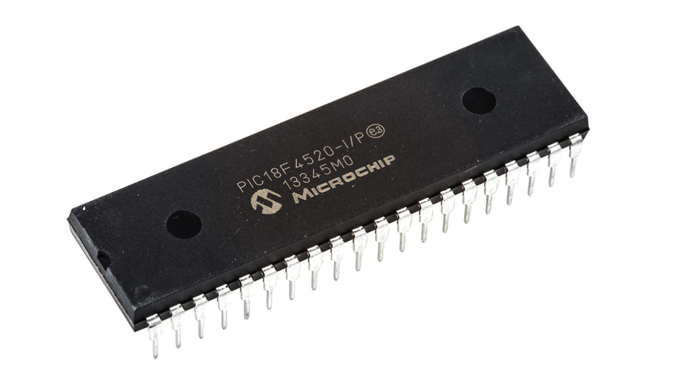
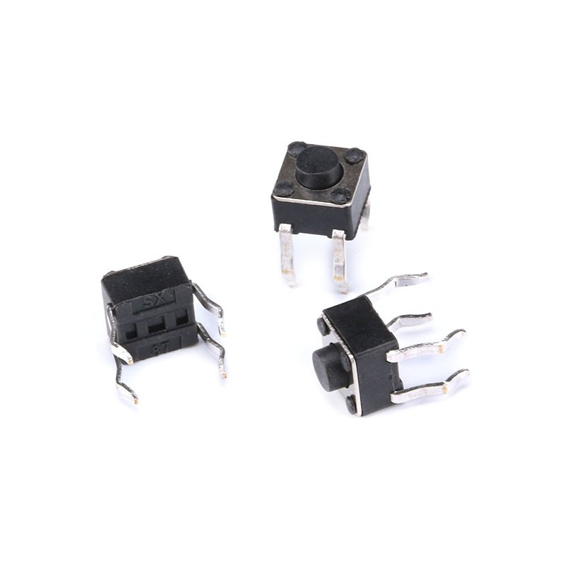
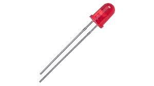
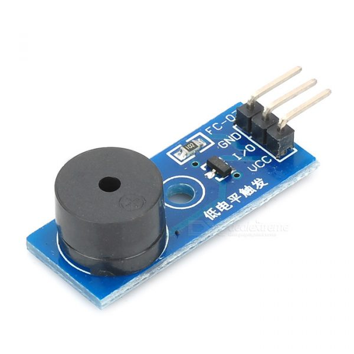

# RFID Electronic Lock

  

An electronic lock system based on the **RDM6300** RFID reader and **PIC18F4520** microcontrollers.

## Overview

This project implements a simple RFID-based electronic lock.
- The RDM6300 reads the RFID card ID and processes it according to the current operating mode.
- Two LEDs indicate the current mode, while the buzzer provides feedback. The servo motor simulates unlocking.

### Demo

[Watch Demo Video](./Video/Demo_Video.mp4)

### Notes
- A dual-microcontroller architecture is used because the PIC18F4520 has only one timer, `TMR2`, available for PWM operation, while both the buzzer and servo require PWM.  
- The two PIC18F4520 devices communicate via UART, with a computer acting as an intermediary.

## Operating Modes

The system provides three operating modes:

| Mode           | LED1 | LED2 | Function                                 |
| -------------- | :--: | :--: | ---------------------------------------- |
| **Register**   |  ON  |  ON  | Add an RFID ID to the database           |
| **Deregister** |  ON  |  OFF | Remove an RFID ID from the database      |
| **Check**      |  OFF |  ON  | Verify an RFID ID and simulate unlocking |

The push button switches between Register and Deregister modes,   
while the variable resistor switches between Check mode and the Register/Deregister modes.

### Register Mode

| Result                  | Status  |
| ----------------------- | ------- |
| Registration Successful | Success |
| ID Already Registered   | Error   |
| ID Database Full        | Error   |
| Invalid ID              | Error   |

### Deregister Mode

| Result                    | Status  |
| ------------------------- | ------- |
| Deregistration Successful | Success |
| ID Not Found              | Error   |
| ID Database Empty         | Error   |
| Invalid ID                | Error   |

### Check Mode

| Result           | Status                 |
| ---------------- | ---------------------- |
| Check Successful | Success + Servo Unlock |
| ID Not Found     | Error                  |
| Invalid ID       | Error                  |

A different buzzer sound is played for successful and failed operations.  
In **Check Mode**, a successful verification activates the servo motor to simulate unlocking.

## Circuit Diagram

## Hardware Components

### PIC18F4520

Two **PIC18F4520** microcontrollers are used in this project.

 

* **Device 1** handles the main system logic, including RFID reading, mode selection, LEDs, button, variable resistor, and buzzer.
* **Device 2** handles the USB-to-TTL interface and SG90 servo motor.
* The two devices communicate via UART.

> The dual-microcontroller architecture allows the buzzer and servo to use PWM independently.

### RDM6300 RFID Reader

The **RDM6300** is a 125 kHz RFID reader used to read the card ID.

  

| RDM6300 | Connection        |
| ------- | ----------------- |
| `ANT1`  | Coil — Black Wire |
| `ANT2`  | Coil — Red Wire   |
| `VCC (below)`   | Device 1 `VDD`    |
| `GND (below)`   | Device 1 `VSS`    |
| `TX`    | Device 1 `RC7/RX` |

### Push Button

The push button is used to switch between operating modes.

| Button     | Connection                    |
| ---------- | ----------------------------- |
| One side   | `RB0/INT0`                    |
| Other side | `VSS`                         |
| Pull-up    | `RB0/INT0` → Resistor → `VDD` |

### LEDs

Two LEDs indicate the current operating mode.

|  LED | PIC18F4520 |
|------|------------------------------|
| LED1 | `RA1/AN1` → Resistor → Anode |
| LED2 | `RA2/AN2` → Resistor → Anode |

Both LED cathodes are connected to `VSS`.

### Buzzer

The buzzer provides audio feedback for successful and failed operations. 

| Buzzer | PIC18F4520 |
| ------ | ---------- |
| `VCC`  | `VDD`      |
| `GND`  | `VSS`      |
| `I/O`  | `RC2/CCP1` |

### Variable Resistor

The variable resistor is used for operating-mode selection through the ADC.

| Variable Resistor | PIC18F4520 |
| ----------------- | ---------- |
| One side          | `VDD`      |
| Center            | `RA0/AN0`  |
| Other side        | `VSS`      |

### USB-to-TTL Serial Cable

The USB-to-TTL cable connects the system to the computer for serial communication.

| TTL Wire | Device 1 | Device 2 |
| -------- | -------- | -------- |
| Red      | `VDD`    | ✗        |
| Black    | `VSS`    | ✗        |
| Green    | ✗        | `RC7/RX` |
| White    | `RC6/TX` | ✗        |

### SG90 Servo Motor

The SG90 servo simulates the physical unlocking mechanism.

| SG90 Wire | PIC18F4520 |
| --------- | ---------- |
| Orange    | `RC2/CCP1` |
| Red       | `VDD`      |
| Brown     | `VSS`      |
